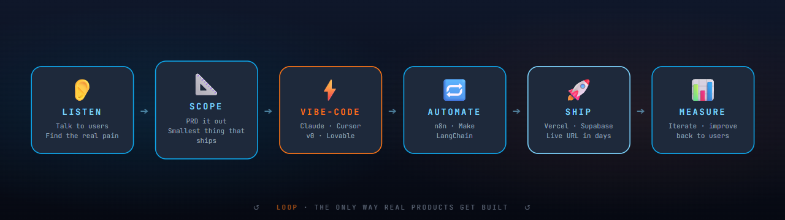
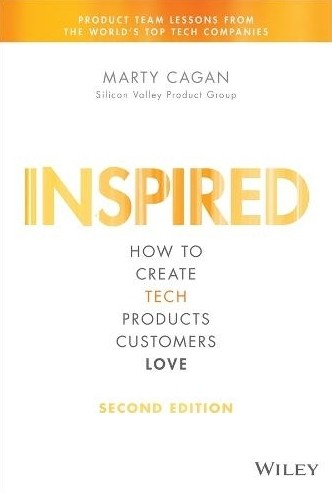
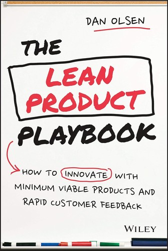
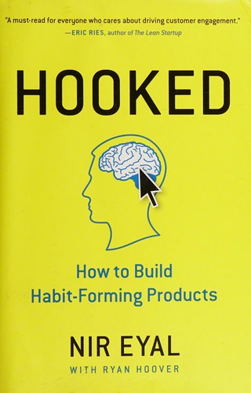
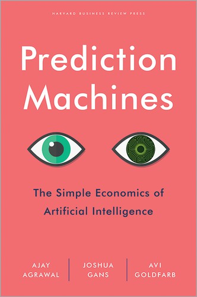

<!-- ════════════════════════════════════════════════════════════════════════════
     ANIMATED WAVE HEADER
     ════════════════════════════════════════════════════════════════════════════ -->

<div align="center">
  
</div>

<!-- ════════════════════════════════════════════════════════════════════════════
     ROTATING TYPING TAGLINES  (Instrument Serif italic — editorial vibe)
     ════════════════════════════════════════════════════════════════════════════ -->

<div align="center">
  <a href="https://satvickmalhotra.vercel.app" target="_blank">
    
  </a>
</div>

<!-- ════════════════════════════════════════════════════════════════════════════
     PROFILE BADGES
     ════════════════════════════════════════════════════════════════════════════ -->

<div align="center">
  
  
  
</div>

<!-- ════════════════════════════════════════════════════════════════════════════
     PRODUCTS IN PRODUCTION COUNTER
     ════════════════════════════════════════════════════════════════════════════ -->

<div align="center">
  <br />
  
  
  
  
</div>

<br />

<!-- ════════════════════════════════════════════════════════════════════════════
     ABOUT ME — with face pic
     ════════════════════════════════════════════════════════════════════════════ -->

## <picture></picture> &nbsp; About Me

<table>
<tr>
<td width="220" align="center" valign="top">
  
  <br />
  <sub><b>Satvick Malhotra</b></sub>
  <br />
  <sub><em>APM · AI · Builder</em></sub>
</td>
<td valign="top">

I build **AI-powered products** end-to-end. By day I'm an **Associate Product Manager (AI)** — by night I'm a vibe coder shipping full-stack apps, automations, and AI tools where **90% of the code is written with AI** (Claude, Cursor, ChatGPT, v0).

My approach is simple: **listen to people's problems → understand them deeply → build the solution with AI → ship**. The engineering matters, but the user matters more. My background is in **data, ML, and automation** — and I'm now growing toward **AI product leadership**, combining that builder instinct with product thinking.

</td>
</tr>
</table>

```yaml
satvick:
  role:        Associate Product Manager · AI
  building:    AI-native products that solve real user problems
  approach:    Listen → Understand → Build with AI → Ship
  focus:       [ AI products, Vibe coding, Automations, Full-stack apps ]
  background:  Data · ML · Automation · Engineering
  learning:    Product strategy · LLM ops · Management
  goal:        Management + AI leadership
  open_to:     [ Product Manager (AI), AI Product Lead, AI Automation, Founding PM ]
  fun_fact:    I ship 10× faster vibe-coding with AI than writing every line myself
```

- 🌐  **Portfolio**  ·  [satvickmalhotra.vercel.app](https://satvickmalhotra.vercel.app)
- 📖  **Case studies**  ·  [github.com/SatvickMalhotra/case-studies](https://github.com/SatvickMalhotra/case-studies)
- 💼  **LinkedIn**  ·  [in/satvick-malhotra02](https://www.linkedin.com/in/satvick-malhotra02/)
- 📫  **Email**  ·  satvickmalhotraofficial@gmail.com

<br />

<!-- ════════════════════════════════════════════════════════════════════════════
     HOW I BUILD  —  Mermaid diagram
     ════════════════════════════════════════════════════════════════════════════ -->

## <picture></picture> &nbsp; How I Build with AI

<div align="center">
  
</div>

> **Why "vibe coding"?** Most code today shouldn't be written by humans line-by-line — it should be *directed*. I describe the product in words, AI writes the code, I review, I iterate. The result: I ship at 10× the speed of writing every line myself, and I spend the rest of my time understanding users.

<br />

<!-- ════════════════════════════════════════════════════════════════════════════
     TECH STACK
     ════════════════════════════════════════════════════════════════════════════ -->

## <picture></picture> &nbsp; The Stack I Build With

<div align="center">

**🤖 AI Building Tools — my daily drivers**


**🎯 Product & Discovery**


**⚡ Stack I Vibe-Code With**


**🔁 Automation & Workflow**


**☁️ Hosting & Data**


**📊 Data & ML — my engineering background**


</div>

<br />

<!-- ════════════════════════════════════════════════════════════════════════════
     BOOKS SHAPING MY THINKING
     ════════════════════════════════════════════════════════════════════════════ -->

## <picture></picture> &nbsp; Books Shaping My Thinking

<table>
<tr>
  <td align="center" width="16%">
    <br />
    <sub><b>Inspired</b></sub><br />
    <sub><em>Marty Cagan</em></sub><br />
    <sub>How modern product teams ship things people love</sub>
  </td>
  <td align="center" width="16%">
    <br />
    <sub><b>Continuous<br />Discovery Habits</b></sub><br />
    <sub><em>Teresa Torres</em></sub><br />
    <sub>Talking to users every single week</sub>
  </td>
  <td align="center" width="16%">
    <br />
    <sub><b>The Lean Product<br />Playbook</b></sub><br />
    <sub><em>Dan Olsen</em></sub><br />
    <sub>Six steps from idea to product-market fit</sub>
  </td>
  <td align="center" width="16%">
    <br />
    <sub><b>The Mom Test</b></sub><br />
    <sub><em>Rob Fitzpatrick</em></sub><br />
    <sub>How to talk to customers without lying to yourself</sub>
  </td>
  <td align="center" width="16%">
    <br />
    <sub><b>Hooked</b></sub><br />
    <sub><em>Nir Eyal</em></sub><br />
    <sub>How habit-forming products work</sub>
  </td>
  <td align="center" width="16%">
    <br />
    <sub><b>Prediction<br />Machines</b></sub><br />
    <sub><em>Ajay Agrawal et al.</em></sub><br />
    <sub>The simple economics of AI</sub>
  </td>
</tr>
</table>

<br />

<!-- ════════════════════════════════════════════════════════════════════════════
     CONTRIBUTIONS
     ════════════════════════════════════════════════════════════════════════════ -->

## <picture></picture> &nbsp; Contributions

<div align="center">
  <a href="https://git.io/streak-stats">
    
  </a>
</div>

<br />

<!-- ════════════════════════════════════════════════════════════════════════════
     TROPHIES
     ════════════════════════════════════════════════════════════════════════════ -->

## <picture></picture> &nbsp; Trophy Showcase

<div align="center">
  
</div>

<br />

<!-- ════════════════════════════════════════════════════════════════════════════
     ACTIVITY GRAPH
     ════════════════════════════════════════════════════════════════════════════ -->

## <picture></picture> &nbsp; Build Activity

<div align="center">
  
</div>

<br />

<!-- ════════════════════════════════════════════════════════════════════════════
     CONNECT
     ════════════════════════════════════════════════════════════════════════════ -->

## <picture></picture> &nbsp; Let's Build Together

If you're hiring an **AI Product Manager**, **AI Product Lead**, or **Founding PM** — or just want to riff on AI products and vibe coding — my inbox is open.

<div align="center">
  <a href="https://satvickmalhotra.vercel.app" target="_blank">
    
  </a>
  &nbsp;
  <a href="https://github.com/SatvickMalhotra/case-studies" target="_blank">
    
  </a>
  &nbsp;
  <a href="https://www.linkedin.com/in/satvick-malhotra02/" target="_blank">
    
  </a>
  &nbsp;
  <a href="mailto:satvickmalhotraofficial@gmail.com">
    
  </a>
  &nbsp;
  <a href="https://github.com/SatvickMalhotra" target="_blank">
    
  </a>
</div>

<br />

<!-- ════════════════════════════════════════════════════════════════════════════
     QUOTE OF THE DAY
     ════════════════════════════════════════════════════════════════════════════ -->

<div align="center">
  
</div>

<br />

<!-- ════════════════════════════════════════════════════════════════════════════
     FOOTER WAVE
     ════════════════════════════════════════════════════════════════════════════ -->

<div align="center">

### ⭐ Thanks for stopping by — if you're building with AI, let's connect ⭐

</div>


